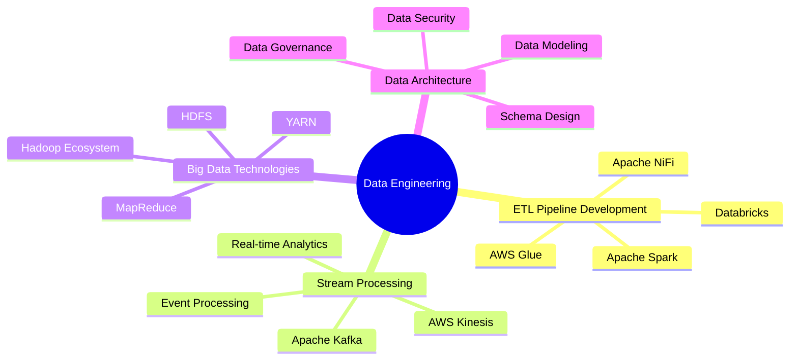
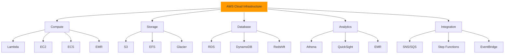

  

  

  

    
    
  

## 👩‍💻 About Me
Passionate Data Engineer with extensive experience in building and optimizing data pipelines, implementing cloud-native ETL solutions, and driving data-driven decision making. Currently pursuing MS in Computer Science at Florida Institute of Technology, specializing in Big Data Analytics and Data Science.

### What I Bring to the Table:
- 🔄 Reduced data processing time by 30% through optimized ETL pipeline development
- 📊 Expertise in processing and analyzing 1TB+ daily data volumes
- ☁️ Proven track record in AWS cloud infrastructure optimization
- 🚀 Improved system performance by 40% using advanced SQL optimization
- 🔧 Automated critical workflows reducing manual intervention by 40%

## 🛠️ Technical Expertise

### 🔧 Core Competencies

### 🛠️ Technical Stack Matrix

| Category | Tools & Technologies | Expertise |
|----------|---------------------|-----------|
| **ETL/ELT** | Apache Spark, AWS Glue, Databricks, Airflow | ⭐⭐⭐⭐⭐ |
| **Stream Processing** | Apache Kafka, AWS Kinesis, Storm | ⭐⭐⭐⭐ |
| **Data Lakes** | AWS S3, Delta Lake, Data Catalogs | ⭐⭐⭐⭐⭐ |
| **Data Warehousing** | Redshift, Snowflake, BigQuery | ⭐⭐⭐⭐ |

### ☁️ Cloud Architecture Expertise

### 🔄 Data Pipeline Architecture

| Pipeline Type | Technologies | Use Cases |
|--------------|--------------|----------|
| **Batch Processing** | AWS Glue, EMR, Spark | Data Warehousing, Daily Aggregations |
| **Stream Processing** | Kinesis, MSK, Lambda | Real-time Analytics, Event Processing |
| **ML Pipelines** | SageMaker, Step Functions | Model Training, Inference |
| **ETL Workflows** | Airflow, AWS Glue | Data Integration, Transformation |

### Languages & Frameworks

| Category | Technologies |
|----------|-------------|
| **Core Languages** |    |
| **Big Data** |   |
| **ML/AI** |   |
| **Visualization** |   |

### 💾 Database Technologies & Expertise

```mermaid
graph TB
    DB[Database Expertise] --> RDBMS[RDBMS Systems]
    DB --> NOSQL[NoSQL Solutions]
    DB --> WARE[Data Warehousing]
    DB --> CACHE[Caching Systems]
    DB --> SEARCH[Search Engines]
    
    RDBMS --> PostgreSQL
    RDBMS --> MySQL
    RDBMS --> Oracle
    
    NOSQL --> MongoDB
    NOSQL --> DynamoDB
    NOSQL --> Cassandra
    
    WARE --> Redshift
    WARE --> Snowflake
    WARE --> BigQuery
    
    CACHE --> Redis
    CACHE --> Memcached
    
    SEARCH --> Elasticsearch
    SEARCH --> Solr

    classDef default fill:#232F3E,stroke:#FF9900,stroke-width:2px;
    classDef category fill:#146EB4,stroke:#FF9900,stroke-width:4px;
    class DB,RDBMS,NOSQL,WARE,CACHE,SEARCH category
```

| Category | Primary Tools | Experience Level |
|----------|--------------|------------------|
| **RDBMS** | PostgreSQL, MySQL, Oracle | ⭐⭐⭐⭐⭐ |
| **NoSQL** | MongoDB, DynamoDB, Cassandra | ⭐⭐⭐⭐ |
| **Data Warehouse** | Redshift, Snowflake, BigQuery | ⭐⭐⭐⭐⭐ |
| **Caching** | Redis, Memcached | ⭐⭐⭐⭐ |
| **Search** | Elasticsearch, Solr | ⭐⭐⭐ |

## 📊 Analytics & Contributions

## 🎯 Current Focus
- Building scalable data pipelines for real-time analytics
- Implementing ML models in production environments
- Optimizing cloud infrastructure costs
- Exploring streaming analytics solutions

## 🌱 Professional Development
- AWS Certified Data Analytics - Specialty
- AWS Certified Solutions Architect
- Databricks Certified Associate Developer
- Apache Spark Developer Certification

## 📬 Get in Touch
I'm always interested in discussing:
- Data Engineering Best Practices
- Cloud Architecture
- ETL Pipeline Optimization
- Big Data Technologies
- Machine Learning Operations

  

