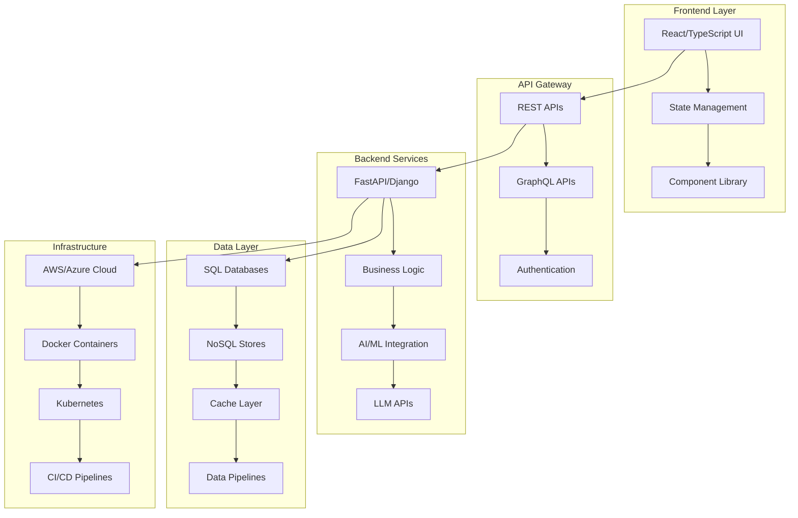

  

  

  

    
    
    
  

## 🚀 About Me

Results-driven **Full-Stack Engineer** with 5+ years of experience architecting and building scalable, end-to-end applications. I specialize in creating engaging user interfaces with **React & TypeScript** and engineering robust backend services using **Python (FastAPI, Django)** and **Java (Spring Boot)**. 

With an **MS in Computer Science from Florida Institute of Technology**, I excel at integrating **AI/ML capabilities**, **Large Language Models (LLMs)**, and building cloud-native applications that solve real-world problems.

### 🎯 What I Bring:
- 🔧 **Full-Stack Expertise**: End-to-end application development from UI to database
- 🤖 **AI Integration**: LLMs, OCR pipelines, and voice assistants in production
- ☁️ **Cloud Native**: AWS & Azure with Infrastructure as Code (Terraform)
- 📊 **Data Engineering**: Processing 5TB+ data monthly with Spark & Kafka
- 🚀 **Performance**: 40% reduction in processing times through optimization

## 🛠️ Tech Stack

### Frontend Development

### Backend Development

### Cloud & DevOps

### AI/ML & Data

### Databases

## 🏗️ Architecture Expertise

## 💼 Professional Experience

### **Full Stack AI Engineer** @ Arkatech Solutions *(May 2025 - Present)*
- 🏗️ **SmartBuy eCommerce Platform**: Built complete full-stack AI application with React frontend and FastAPI backend
- 🤖 **Auto Loan AI Plugin**: Integrated AWS Textract OCR and voice assistants, reducing processing time by 40%
- ☁️ **Infrastructure Automation**: Automated Azure deployments with Terraform, cutting deployment cycles by 40%

### **AI/ML Full Stack Developer** @ Anguliyam *(Aug 2024 - May 2025)*
- 🚂 **Railway Predictive Maintenance**: Developed TensorFlow-based system reducing downtime by 30%
- 📊 **Real-time Dashboards**: Created React dashboards for system monitoring and alerts
- 🗣️ **Voice Navigation**: Integrated LLM APIs for voice-powered fitness app recommendations
- 🏢 **Enterprise Solutions**: Built proprietary applications with advanced AI capabilities (*private repos*)

### **Big Data Engineer** @ Cognizant *(Jan 2022 - Aug 2022)*
- 📈 **ETL Pipelines**: Built pipelines processing 5TB+ monthly data using Apache Spark and Kafka
- 🚀 **Performance Optimization**: Reduced query latency by 30% through SQL/NoSQL database tuning
- 🔧 **Scalable APIs**: Developed Java and Python APIs supporting 15+ projects

## 🚀 Featured Projects

| Project | Tech Stack | Impact | Repo Status |
|---------|------------|--------|-------------|
| **SmartBuy AI eCommerce** | React, FastAPI, AWS Lambda, Gemini API | 25% ↑ user engagement, 35% ↓ infrastructure costs | 🔓 Public |
| **Blinds & Boundaries Web App** | React, FastAPI, Azure, Computer Vision | Virtual try-on experience, ↑ conversions | 🔒 Private |
| **Railway Predictive Maintenance** | TensorFlow, Spark, AWS SageMaker, React | 30% ↓ equipment downtime | 🔓 Public |
| **Auto Loan AI Plugin** | AWS Textract, Voice AI, Lambda | 40% ↓ loan processing time | 🔒 Private |
| **Fitness Transformation App** | React, LLM APIs, Voice Navigation | Personalized AI-driven guidance | 🔒 Private |

> 💡 **Note**: Some of my most innovative projects are in private repositories due to proprietary technology and client confidentiality. These include advanced **computer vision applications**, **voice-powered AI assistants**, and **enterprise-grade automation solutions**.

## 📊 GitHub Analytics

  
  

  

  

### 📈 Live Contribution Stats

  

### 🔥 Current Activity
- 📊 **Real-time Stats**: All metrics update automatically from GitHub API
- 🏆 **Achievement System**: Trophies unlock based on actual contributions
- 🔒 **Private Repos**: Contributions included when enabled in GitHub settings
- 📈 **Multi-year History**: Complete development journey tracked

> 💡 **Note**: Stats include both public and private repository contributions. Enable "Private contributions" in your GitHub profile settings for full visibility.

## 🎓 Education & Certifications

### 🎓 Education
- **MS Computer Science** - Florida Institute of Technology (2022-2024) ✅ **Graduated**
- **BS Computer Science (Big Data Analytics)** - KL University, India (2018-2022)

### 📜 Certifications
- ☁️ **AWS Certified Solutions Architect – Associate**
- 🌐 **Cisco Certified Network Associate (CCNA)**
- 🔧 **ServiceNow Certified Application Developer**
- 🗄️ **Oracle Database SQL Certified Associate**

## 🌟 What I'm Working On

- 🔬 **Building scalable AI-powered applications** with modern tech stacks
- 🚀 **Optimizing cloud infrastructure** for cost and performance
- 🤖 **Exploring cutting-edge LLM integrations** in production systems
- 📊 **Real-time data processing** and analytics solutions

## 📬 Let's Connect!

I'm always excited to collaborate on innovative projects and discuss:
- 🏗️ **Full-Stack Architecture** best practices
- 🤖 **AI/ML Integration** in web applications
- ☁️ **Cloud-Native Development** strategies
- 📈 **Performance Optimization** techniques

  

---

  <i>💡 "Building the future, one line of code at a time" 💡</i>

